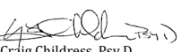

# 2021.05.18 Kenneth.Nielsen Coach Confirmation Letter

**Link:**  
**Date:** 2021-05-18
**Category:** Kenneth Nielsen Qualification

---

5/18/21 To Whom it May Concern: Re: Kenneth Nielsen This letter is to confirm that Kenneth Nielsen successfully completed the Coach Seminar with Dr. Childress: Working in a Mental Health Treatment Team, 5/15/21. 

As a family coach supporting healthy child development, Mr. Nielsen has my consultation support for the children and families he supports and helps, he understands that; In the absence of child abuse, parents have the right to parent according to their cultural values, their personal values, and their religious values. In the absence of child abuse, each parent should have as much time and involvement with the child as possible. When there is child abuse, we protect the child. There are four diagnoses of child abuse in the Child Maltreatment section of the DSM-5: Child Physical Abuse (V995.54), Child Sexual Abuse (V995.53), Child Neglect (V995.52), Child Psychological Abuse (V995.51). Each of these child abuse diagnoses is equivalent in the severity of the damage they cause to the child, they differ only in the type of damage done, not in the severity of damage done to the child. Child Psychological Abuse is devastating, it destroys the child from the inside-out.

Each of these child abuse diagnoses warrants a proper risk assessment when a diagnostic consideration is child abuse. When there is child abuse, we protect the child. 

As a family coach, Mr. Nielsen encounters many families, and he seeks to protect children from the devastating effects of child psychological abuse by a parent who is using the child as a weapon in the spousal conflict with the other parent-and-spouse. Mr. Nielsen has my support in his efforts to protect children from the devastating developmental effects of Child Psychological Abuse - DSM-5 V995.51. Craig Childress, Psy.D.

 Clinical Psychologist, PSY 18857 drcachildress.bainbridge@gmail.com